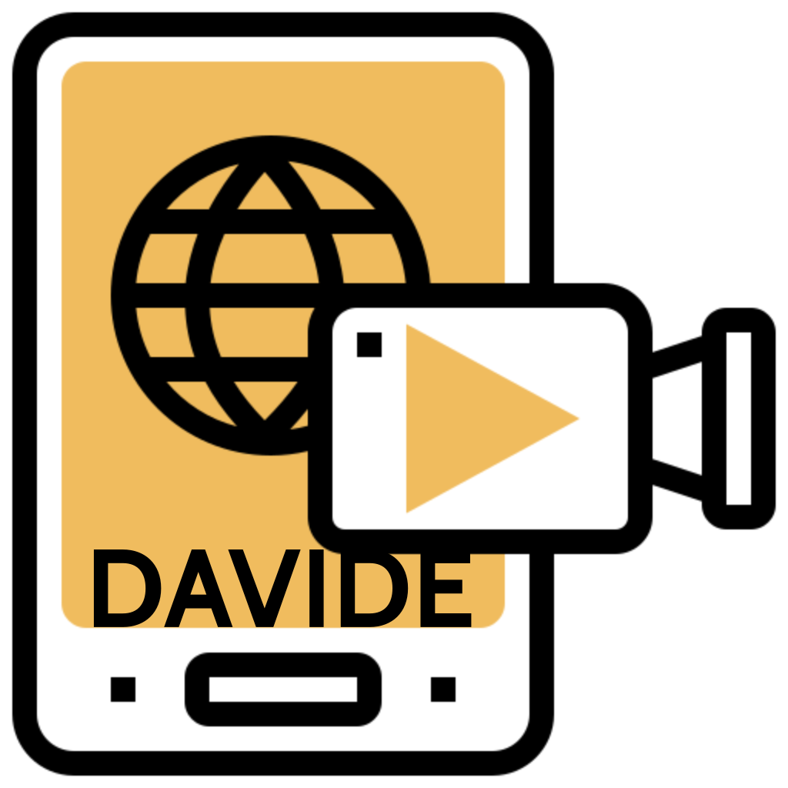
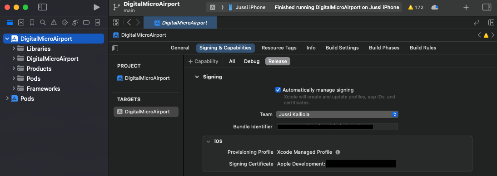
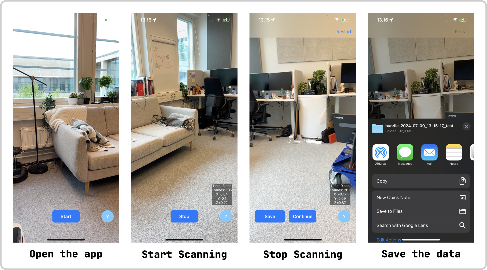

# DAVIDE App
[](https://germanftv.github.io/ParallaxICB.github.io/)
[](https://arxiv.org/abs/2409.01274)

This repository contains the official iOS application for recording synchronized RGB-D videos, which were used to create the DAVIDE dataset introduced in the paper **"DAVIDE: Depth-Aware Video Deblurring" (ECCVW 2024)**.

<p align="center">
  
</p>

 ### [Project Page](https://germanftv.github.io/DAVIDE.github.io/) | [arXiv](https://arxiv.org/abs/2409.01274) | [Benchmark Repository](https://github.com/germanftv/DAVIDE-Benckmark) | [Dataset Synthesis Repository](https://github.com/germanftv/DAVIDE-Synthesis.git) | [Data Access Form](https://docs.google.com/forms/d/e/1FAIpQLSeQ2w4xsoIkzJ6kNseSiHkMaj303_tXRs2v23wqF3chfSF1FQ/viewform?usp=header)

## Citation

If you use parts of this work, or otherwise take inspiration from it, please consider citing:

    @article{torres2024davide,
        title={DAVIDE: Depth-Aware Video Deblurring},
        author={Torres, German F and Kalliola, Jussi and Tripathy, Soumya and Acar, Erman and K{\"a}m{\"a}r{\"a}inen, Joni-Kristian},
        journal={arXiv preprint arXiv:2409.01274},
        year={2024}
        }

## Getting the App Running

1. Open the .xcodeproj project file with Xcode (tested for Xcode 15).
2. Set up signing and provisioning. You'll have to make an Apple developer account if you don't have one already. Check the `Automatically manage signing` box to simplify the process.




3. Plug in your device (tested with iPhone 13 Pro), and trust it. It should appear in the list of devices at the top of Xcode. Select it as the device to build to.
4. As this is an app not from the app store, you will have to trust the developer in you settings under `Settings / General / VPN & Device Management` (May depend on your iOS version).
6. Run the application (Provide access to camera and location for the app).

## Using the App
Short description of the app. e.g., "App is used to capture RGB, depth, confidence images, camera pose (using ARKit), and IMU sensory data."



1. **Open the application.** First time opening the app, accept request to use camera, location, and storage. The app opens into camera view with **Start** button as UI element. Press **Start** to begin scanning. 
2. **Start scanning.** App starts the scanning immidiately after pressing the **Start** button. Scanning statistics can be seen on the bottom right side of the view; Duration (sec), captured frames, and position of the camera (determined by ARKit, check *notes*). Scanning can be stopped by pressing **Stop** button.
3. **Stop scanning.** After stopping the scan, it is possible to resume scanning by pressing **Continue**, start over by pressing **Restart**, or save the collected data by pressing **Save**.  
4. **Save the data.** When done, press **Save** button to save the data. It might take a minute to process and pack all the data. Save the data to iCloud, locally on iPhone, or send to your other device using AirDrop.

**Notes:** iPhone pose estimation is provided by [Apple ARKit API](https://developer.apple.com/augmented-reality/arkit/), and uses visual-inertial odometry which combines data from motion sensors with computer vision analysis of the scene. ARKit tracks differences in the positions of notable features in the scene and compares that information with motion sensing data. More about the world tracking can be found from [Apple documentation](https://developer.apple.com/documentation/arkit/arkit_in_ios/configuration_objects/understanding_world_tracking).

## Recorded Data
 App captures RGB, depth, and confidence frames, camera intrinsics, poses (ARKit), and motion sensor data provided by IMU (gyroscope and accelerometer). Depth and confidence frames are saved as individual binary files, but RGB frames are stored as video file (.mov). Frame metadata and poses are saved as text file. Data is captured in 60 hertz. Apple ARKit and CoreMotion APIs are used to read the sensory readings. Orientation in ARKit is [Gravity](https://developer.apple.com/documentation/arkit/arconfiguration/worldalignment/gravity) and in CoreMotion Orientation [xArbitraryZVertical](https://developer.apple.com/documentation/coremotion/cmattitudereferenceframe/1615953-xarbitraryzvertical).

Description of ARPoses.txt
```
# timestamp, ARKit Camera translation(x,y,z), ARKit Camera orientation in Quaternion(w,x,y,z), Attitude Quaternion(w,x,y,z), Attitude Euler(roll,pitch,yaw), Rotation Rate(x,y,z), Acceleration(x,y,z), Gravity(x,y,z)
```

Description of Frames.txt
```
# timestamp, Frame index, Camera intrinsics(fx, fy, cx, cy)
```

 | Name | iOS type | More |
|------|----------|------------|
| RGB | [Metal MTLTexture RGBA 8bit](https://developer.apple.com/documentation/metal/mtltexture) | Resolution 1920x1440. Converted to video file (.mov), using codec .h264 |
| Depth | [Metal MTLTexture Float](https://developer.apple.com/documentation/metal/mtltexture) | Resolution 256x192 |
| Confidence | [Metal MTLTexture 8bit](https://developer.apple.com/documentation/metal/mtltexture) | Resolution 256x192 |
| Camera intrinsics | [ARCamera Intrinsics](https://developer.apple.com/documentation/arkit/arcamera/2875730-intrinsics) | The intrinsic matrix (commonly represented in equations as K) is based on physical characteristics of the device camera and a pinhole camera model. |
| Pose (ARKit) | [ARCamera Transform](https://developer.apple.com/documentation/arkit/arcamera/2866108-transform) | y-axis is parallel to gravity, and its origin is the initial position of the device. |
| SceneKit Quaternion | [SceneKit pointOfView](https://developer.apple.com/documentation/scenekit/scnscenerenderer/1523982-pointofview) | y-axis is parallel to gravity, and its origin is the initial position of the device.  |
| Attitude | [Core Motion Attitude](https://developer.apple.com/documentation/coremotion/cmdevicemotion/1616050-attitude) | Attitude of the device (quaternion & euler angles) |
| Rotation Rate | [Core Motion rotationRate](https://developer.apple.com/documentation/coremotion/cmdevicemotion/1615967-rotationrate) | Rotation rate of the device (x,y,z) |
| Accelerometer | [Core Motion Acceleration](https://developer.apple.com/documentation/coremotion/cmdevicemotion/1616149-useracceleration) | The acceleration that the user is giving to the device (x, y, z) |
| Gravity | [Core Motion Gravity](https://developer.apple.com/documentation/coremotion/cmdevicemotion/1616164-gravity) | The gravity acceleration vector expressed in the device's reference frame. (x, y, z)  |

## Other Resources

1. [**Benchmark Repository**](https://github.com/germanftv/DAVIDE-Benckmark): Contains the source code for benchmarking deep video deblurring methods on the DAVIDE dataset.

2. [**Dataset Synthesis Repository**](https://github.com/germanftv/DAVIDE-Synthesis.git): Provides the source code to synthesize the Depth-Aware VIdeo DEblurring (DAVIDE) dataset from raw captured videos.

3. [**Data Access Form**](https://docs.google.com/forms/d/e/1FAIpQLSeQ2w4xsoIkzJ6kNseSiHkMaj303_tXRs2v23wqF3chfSF1FQ/viewform?usp=header): Submit this form to request access to the released DAVIDE dataset and related resources.


## Acknowledgements

Parts of this repo is inspired by the following repositories and sample codes:
- [Scanning and detecting 3D objects (Apple Sample Code)](https://developer.apple.com/documentation/arkit/arkit_in_ios/content_anchors/scanning_and_detecting_3d_objects)
- [HNDR](https://github.com/princeton-computational-imaging/HNDR)
- [Icon by Eucalyp, FlatIcon. Borrowed and edited](https://www.flaticon.com/free-icons/recording)
