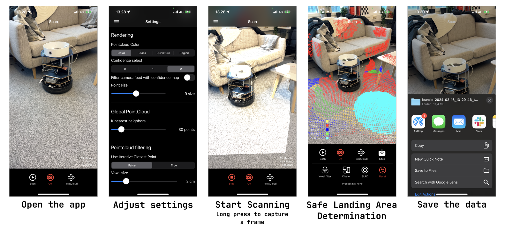

# DAVIDE-app

This is the official code repository for the iOS application developed for **ARTICLE**: [LINK TO ARTICLE](https://google.com)

If you use parts of this work, or otherwise take inspiration from it, please consider citing the thesis:
```
bibtex
```

## Getting the App Running

1. Open the .xcworkspace project file with Xcode (tested for Xcode 15).
2. Set up signing and provisioning. You'll have to make an Apple developer account if you don't have one already. Check the `Automatically manage signing` box to simplify the process.


3. Plug in your device (tested with iPhone 13 Pro), and trust it. It should appear in the list of devices at the top of Xcode. Select it as the device to build to.
4. As this is an app not from the app store, you will have to trust the developer in you settings under `Settings / General / VPN & Device Management` (May depend on your iOS version).
6. Run the application (Provide access to camera and location for the app).

## Using the App
App can be used to perform Safe Landing Area Determination online whereas the safe landing area is visualized as an AR element in the physical space, or data collection app for offline determination (or for other purposes).



1. **Open the application.** First time opening the app, accept request to use camera, location, and storage. The app opens into camera view with few UI elements; bottom task bar for scanning and modifying the camera view, button in the top left corner for settings, and some statistics about the scan shown on top of taskbar. 
2. **Adjust the settings.** Click the icon in the top left corner to open the settings window, and adjust parameters depending on the usecase. It is possible to tune parameters in the following areas: rendering, global point cloud, point cloud filtering, safe landing area determination, terrain complexity evaluation, and ROS. More detailed description of parameters and their usage can be found below from the *Notes* section.
3. **Start scanning.** Press *Scan* button to start. *Long press* anywhere on the camera view will capture a frame and the frame is visualized in the camera view as AR element. More detailed description can be found from the [thesis](https://trepo.tuni.fi/handle/10024/148220). Clicking *Point cloud* button will change the visualization to Mesh view. To visualize point cloud/mesh without camera feed, press *Off* button.
4. **Process point cloud.** Press *Stop* button when finished with scanning and move on to point cloud processing or saving the data (skip to the nextstep). Point cloud processing is performed in sequence; [voxel grid filtering](https://pointclouds.org/documentation/tutorials/voxel_grid.html), [region clustering](https://pcl.readthedocs.io/projects/tutorials/en/latest/region_growing_segmentation.html), and finally [Safe landing area determination](https://ieeexplore.ieee.org/document/9189499). Processing may take a long time depending on the size of the point cloud, especially the point cloud classification. 
6. **Save the data.** When done, press *Save* button to save the data. It might take a minute to process and pack all the data. Save the data to iCloud, locally on iPhone, or send to your other device using AirDrop.

**Notes:** PCL implementation of [KDTree](https://pointclouds.org/documentation/tutorials/kdtree_search.html), [Voxel grid filtering](https://pointclouds.org/documentation/tutorials/voxel_grid.html), [Region clustering](https://pcl.readthedocs.io/projects/tutorials/en/latest/region_growing_segmentation.html), [Normal estimation](https://pointclouds.org/documentation/tutorials/normal_estimation.html), and [Plane fitting](https://pointclouds.org/documentation/tutorials/planar_segmentation.html) are used. Safe landing area determination algorithm used is proposed by [Yan et al.](https://ieeexplore.ieee.org/document/9189499) which is modified to be more suitable for irregular and noisy point clouds. More about the modifications can be found from the [thesis](https://trepo.tuni.fi/handle/10024/148220).

## Recorded Data
 App collects RGB frames, depth- and confidence maps, camera poses, pointcloud computed from depth images (raw), filtered, 3D mesh(from ARKit) processed, classified point cloud, and app parameters. After collecting data, press `Save` and save the data to iCloud, locally, or AirDrop to your other device.

